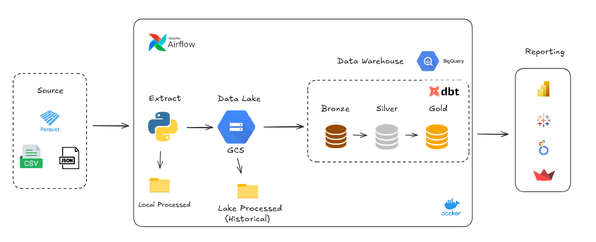

# Data Pipeline Project with Airflow, dbt, and Google Cloud

## Overview
### This project involves building an automated data pipeline using Airflow, Cosmos, dbt, and Google Cloud. The main goal of this pipeline is to integrate different data sources, process and transform raw data, and store it in a cloud data warehouse (Google BigQuery). The project uses Docker for containerization and orchestration to ensure easy deployment and scalability. Below is a step-by-step breakdown of how the data pipeline is built and operates. ⬇️⬇️!

## Architecture:

## Building the Pipeline
================
1. Data Ingestion: Store raw data into a data lake. Here we'll use Google cloud storage (GCS).

2. ETL/ELT Pipelines:
    - Transfer data from the lake to a structured data warehouse, BigQuery.
    - Use dbt (dbt CLI) to create simple models that transform raw data into structured, analytics-ready formats.

3. Orchestration: Use Airflow (via Astronomer) to automate and schedule pipeline tasks.

1. [Docker](https://www.docker.com):
    Docker:
    Docker is a containerization platform that packages applications and their dependencies into portable containers. In this project, Docker is used to containerize all pipeline components (dbt, Airflow, Metabase, etc.), ensuring consistent environments across both local development and production. This simplifies setup and makes the pipeline easily replicable and scalable.

2. [Astro](https://www.astronomer.io/docs):
    Astro (by Astronomer) is a cloud-native platform for orchestrating data workflows, based on Apache Airflow. It simplifies Airflow’s deployment, monitoring, and scaling. In this project, Astro is used to deploy and manage Airflow pipelines with a production-ready interface, providing version control, monitoring, and seamless integration with tools like Cosmos and dbt.

3. [Airflow](https://airflow.apache.org):
    Apache Airflow is an open-source tool for orchestrating workflows, allowing you to programmatically create, schedule, and monitor data pipelines. In this project, Airflow automates the ETL process — from ingesting raw data into GCS, transferring it to BigQuery, transforming it with dbt, and performing quality checks — enabling full automation of the pipeline.

5. [Google Cloud Storage (GCS)](https://console.cloud.google.com):
    GCS is an object storage service designed for unstructured data. It serves as the data lake in this project, where raw datasets are initially stored. GCS provides scalable and cost-efficient storage, accessible by both Airflow and dbt for downstream processing.

6. [BigQuery](https://console.cloud.google.com):
    BigQuery is a fully-managed, serverless data warehouse provided by Google Cloud. In this project, BigQuery serves as the central data warehouse, where cleaned and transformed data (via dbt) is loaded. It supports fast SQL-based analysis and integrates seamlessly with BI tools like Metabase for reporting.

8. [DBT](https://www.getdbt.com/):
    dbt (data build tool) is used to transform raw data in the warehouse using SQL and modular, version-controlled data models. In this project, dbt transforms data to prepare it for analysis in BigQuery. The CLI version of dbt is used, which integrates tightly with both Airflow and Cosmos for automation.

9. [Cosmos](https://www.astronomer.io/cosmos):
    Cosmos is an open-source Airflow provider by Astronomer that enables you to run dbt projects natively as Airflow tasks. In this project, Cosmos dynamically converts dbt models into Airflow tasks, maintaining their dependencies and allowing for fine-grained orchestration, monitoring, and retries, all while keeping the dbt DAG structure intact.

Contact
=======
Connect with me on LinkedIn ✌️ : [Guilherme Arruda](https://www.linkedin.com/in/arruda-guilherme/)